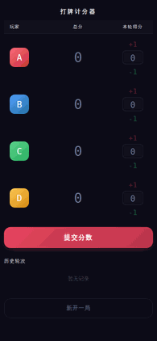

# 打牌计分器

一个简洁的移动端打牌（四人）记分工具，纯前端单页应用，无需后端，支持离线使用。

## 功能特性

- **4 位玩家**：每位玩家用字母标识（默认 A/B/C/D），点击头像可自定义字母
- **滚轮输入分数**：每人通过拖动滚轮选择本轮得分（范围 −20 ~ +20）
- **自动补全**：当 3 位玩家已拨好分数时，第 4 位自动计算（确保总和为 0）
- **分数校验**：提交前检查四人分数之和是否为 0，否则给出提示
- **历史记录**：展示每轮得分，默认显示最近 5 轮，支持展开全部
- **撤销**：可撤销最近一轮的提交
- **新开一局**：清零所有分数（保留玩家字母）
- **本地持久化**：游戏状态存储于 `localStorage`，刷新后恢复
- **彩纸动画**：每次提交分数触发庆祝彩纸效果
- **移动端优化**：触屏友好，支持 iOS Safe Area，深色主题

## 使用方法

直接访问 GitHub Pages 即可，无需安装任何依赖：

**https://lingceng.github.io/scorecard/**

## 规则说明

每轮结束后，各玩家拨动对应滚轮选择得分，**四人分数之和必须为 0**，然后点击「提交分数」。
若只拨了 3 位玩家的分数，第 4 位会自动高亮并填入对应值。

## 技术栈

- 原生 HTML / CSS / JavaScript（无框架、无构建工具）
- `localStorage` 持久化
- Google Fonts（DM Mono + Noto Sans SC）
