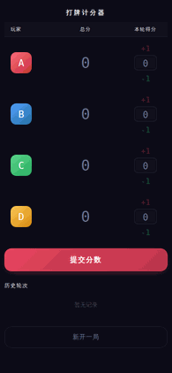

# 科科打牌记分器

一个简洁的移动端打牌（3–6 人）记分工具，纯前端单页应用，无需后端，支持离线使用。

## 功能特性

- **3–6 位玩家**：统一深色头像底板，可使用 emoji、字母或一两个中文作为身份标记
- **滚轮输入分数**：每人通过拖动滚轮选择本轮得分（人数越多，可选范围越大）
- **自动补全**：当只剩 1 位玩家未拨分时，自动计算最后一人的分数（确保总和为 0）
- **分数校验**：提交前检查所有玩家分数之和是否为 0，否则给出提示
- **历史记录**：固定列宽展示每轮得分，默认显示最近 5 轮，支持展开全部
- **撤销**：可撤销最近一轮的提交
- **新开一局**：清零所有分数（保留人数范围内的玩家标记）
- **本地持久化**：游戏状态存储于 `localStorage`，刷新后恢复
- **分级结算效果**：根据赢分强度呈现积少成多、稳稳收租、全桌降温、暴雪封桌等效果
- **近期称号**：自动识别连胜、连负和炸弹累计表现
- **炸弹模式**：指定赢家后统一向其他玩家收取 2 分或 4 分，并单独记录炸弹数据
- **可选音效**：结算音效默认关闭，可在牌桌设置中开启
- **移动端优化**：触屏友好，支持 iOS Safe Area，深色主题

## 使用方法

直接访问在线版本即可，无需安装任何依赖：

- 主入口：[https://pkscore.netlify.app/](https://pkscore.netlify.app/)
- 备用入口：[https://lingceng.github.io/scorecard/](https://lingceng.github.io/scorecard/)
- 微信小程序：搜索「科科打牌记分器」

## 规则说明

每轮结束后，各玩家拨动对应滚轮选择得分，**所有玩家分数之和必须为 0**，然后点击「提交分数」。
若只剩 1 位玩家未拨分，系统会自动高亮并填入对应值。

## 技术栈

- 原生 HTML / CSS / JavaScript（无框架、无构建工具）
- `localStorage` 持久化
- Google Fonts（DM Mono + Noto Sans SC）
